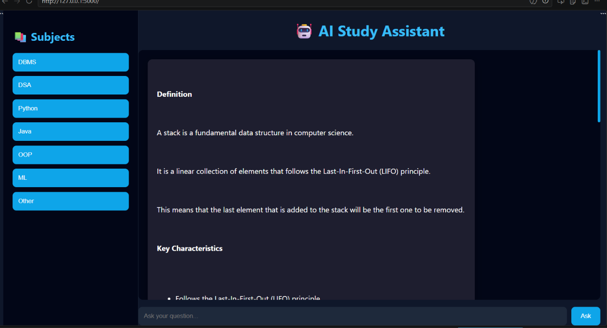

# 🤖 AI Study Assistant

An intelligent AI Study Assistant designed to help students learn technical subjects like DBMS, DSA, Python, Java, OOP, and Machine Learning using Artificial Intelligence and Natural Language Processing.

---

# 📌 Features

* 🤖 AI-powered study chatbot system
* 📚 Subject-wise learning support
* 💬 Chat with AI in real-time
* 🧾 Detailed explanations for concepts and definitions
* 🎓 Helps students understand technical subjects easily
* 🧠 Smart response generation
* 📄 User-friendly interface
* ⚡ Fast and responsive system
* 🔍 Natural Language Processing support
* 🛠 Easy to customize and extend

---

# 🛠 Technologies Used

## Frontend

* HTML
* CSS
* JavaScript
* Responsive Dark UI Design

## Backend

* Python
* Flask
* chatbot.py integration

## AI / ML

* OpenAI API / Gemini API
* NLP Libraries

## Database

* SQLite / MongoDB

---

# 📂 Project Structure

```bash
AI-Assistant/
│
├── static/              # CSS, JS, Images
├── templates/           # HTML files
├── app.py               # Main Flask application
├── chatbot.py           # AI chatbot logic and response handling
├── requirements.txt     # Python dependencies
├── model/               # AI/ML models
├── README.md            # Project documentation
└── .gitignore
```

---

# 🧠 Chatbot Functionality

The `chatbot.py` file handles the core chatbot logic of the project. It is responsible for:

* Processing user messages
* Generating AI responses
* Managing conversation flow
* Connecting AI/NLP models with the frontend

---

# 🚀 Installation

## 1️⃣ Clone the Repository

```bash
git clone https://github.com/your-username/AI-Assistant.git
```

## 2️⃣ Open Project Folder

```bash
cd AI-Assistant
```

## 3️⃣ Create Virtual Environment

```bash
python -m venv venv
```

## 4️⃣ Activate Virtual Environment

### Windows

```bash
venv\Scripts\activate
```

### Mac/Linux

```bash
source venv/bin/activate
```

## 5️⃣ Install Dependencies

```bash
pip install -r requirements.txt
```

## 6️⃣ Run the Project

```bash
python app.py
```

---

# 📸 Project Screenshot

## AI Study Assistant Interface



The project includes a modern dark-themed study dashboard where students can:

* Select subjects from the sidebar
* Ask questions in the chatbot
* Get AI-generated explanations instantly
* Learn programming and technical concepts interactively

Example subjects available:

* DBMS
* DSA
* Python
* Java
* OOP
* Machine Learning

> 📌 Save your screenshot inside a folder named `screenshots` with the filename `ai-study-assistant.png` so the image appears properly on GitHub.

---

# ✨ UI Highlights

* Dark modern interface
* Sidebar-based subject navigation
* Interactive chatbot response section
* Simple and student-friendly design
* Fast response system

---

# 🔮 Future Improvements

* Voice assistant support
* Multi-language support
* AI memory integration
* Better UI/UX
* Mobile app version

---

# 🤝 Contribution

Contributions are welcome.

1. Fork the repository
2. Create a new branch
3. Commit your changes
4. Push to the branch
5. Create a Pull Request

---

# 📜 License

This project is licensed under the MIT License.

---

# 👨‍💻 Author

Developed by Saroj Chaudhary
